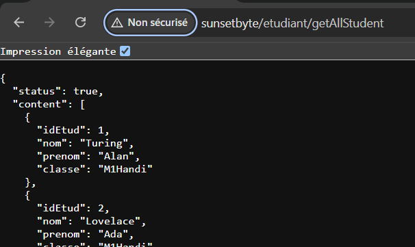

# Utilisation de ContainerDI

Ce guide explique comment utiliser ContainerDI pour créer une nouvelle classe et une fonction, puis les utiliser dans une autre classe.

## Création d'une nouvelle classe

Tout d'abord, nous allons créer une nouvelle classe. Par exemple, une classe `Etudiant`, elle va permettre la gestion des données d'étudiants stockée en BDD.

```php
<?php

class Etudiant
{
    // Ici on créé le constructeur de la classe. On lui ajoute comme unique parametre "ContainerDI $c".
    // Obligatoire si on veut utliser les fonctions de la classe ailleur.
    // Il sera le même pour toute les classes (sauf exeption)
    public function __construct(ContainerDI $c){
        $this->c = $c;
    }

    // Ensuite on définit nos fonctions

    // Ici on créé une classe qui récupère tous les étudiant dans la BDD
    public function getAllStudent()
    {
        // Dans cette exemple supposons que nous avons déja définit une classe de connexion et sa fonction connectBdd() avec MySQLi.

        // On défini dans une variable notre requete
        $request = "SELECT * FROM Etudiant"

        // "$this->c-get(connexion)" permet d'appeler la classe Connexion
        // "->connectBdd()" appelle la fonction connectBdd qui retourne un objet de type MySQLi nous donnant acces aux fonction MySQLi.
        // "prepare()" est une fonction MySQLi qui permet de preparer la requete qu'on lui met en parametre (ici la variable $request)
        
        // On stocke le tous dans une variable (stmt pour statement)
        $stmt = $this->c->get("Connexion")->connectBdd()->prepare($request);
        
        // Puis on exécute la requete
        $stmt->execute();

        // Si on veut récupérer le résultat on utilise get_result(), une fonction MySQLi et on stocke la valeur dans une variable
        $result = $stmt->get_result();

        // On stocke le resultat sous forme de tableau avec fetch_all(MYSQLI_ASSOC), une fonction MySQLi qui retourne le resultat de get_result() sous forme de tableau.
        $data = $result->fetch_all(MYSQLI_ASSOC);

        // On renvoie le resultat de la requete en format Json pour le VueJS avec la fonction send() de ApiResult.
        // send(contenue, bool) prend 2 paramètreS. Le contenu a retourner + un booléen (true ou false) 
        // Ici on lui met true car le resultat est un succès 
        $this->c->get('ApiResult')->send($data, true);
    }
}
```

## Classe Etudiant sans commentaire

```php
class Etudiant
{
    public function __construct(ContainerDI $c){
        $this->c = $c;
    }

    public function getAllStudent()
    {

        $request = "SELECT * FROM Etudiant"
        $stmt = $this->c->get("Connexion")->connectBdd()->prepare($request);
        $stmt->execute();
        $result = $stmt->get_result();
        $data = $result->fetch_all(MYSQLI_ASSOC);
        $this->c->get('ApiResult')->send($data, true);
    }

    // Autres fonctions
}
```

## Petite présision

Dans tes fonctions php, pour gérér les erreurs tu peut ajouter à tes fonction `une condition` qui vérifie `si le resultat retourner est vide ou non`. Si il y a du contenu on retourne le contenu sinon un message d'erreur selon l'erreur.

```php

    public function getAllStudent()
    {

        $request = "SELECT * FROM Etudiant"
        $stmt = $this->c->get("Connexion")->connectBdd()->prepare($request);
        $stmt->execute();
        $result = $stmt->get_result();
        $data = $result->fetch_all(MYSQLI_ASSOC);

        if ($data){
            $this->c->get('ApiResult')->send($data, true);
            // Le bool à true car resultat
        } else {
            $this->c->get('ApiResult')->send('Erreur lors de la récupération des étudiants', false); 
            // Le bool à false car erreur
        }
    }

```

## Pour tester tes fonctions

Pour tester tes fonctions tu les appelles dans la barre de recherche de ton navigateur en suivant le schéma suivant :

sunsetbyte/{nom_de_classe}/{nom_de_fonction}



## Pour les requêtes POST

Il faut savoir que si tu a un INSERT ou un UPDATE, tu aura des information à envoyer dans la base de données. 

Tu ne pourra pas le faire 